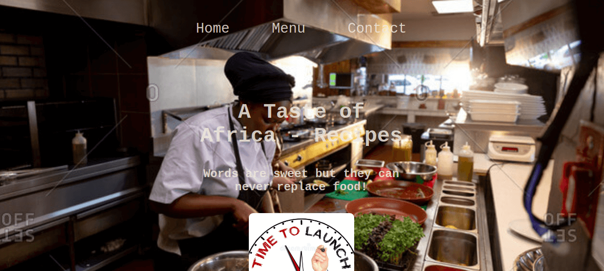

# Restaurant Page

## Description

This is a JavaScript project from Odin's curriculum. It is based on DOM manipulation by dynamically rendering a simple restaurant homepage.
There I used JavaScript alone to generate the entire contents of the website.

## Built With

- JavaScript
- Webpack

## Set up this projecect locally

- Open the terminal in the directory where you want to install the app;
- Run command `git clone git@github.com:FrederickMih/RESTAURANT-PAGE.git` which will clone the project;
- Switch to the main directory of project using cd;
- Open index.html file in your browser from /dist folder.

## Screenshot

|  |
 

### Deployment

This application is deployed on [GitHubPages](https://frederickmih.github.io/RESTAURANT-PAGE/#).

## Authors

👤 **Mih Frederick**

  

## Show your support

Give a ⭐️ if you like this project!

## Acknowledgments

- [Microverse](https://www.microverse.org/)